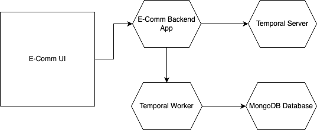

# E-commerce Test App with Temporal

This is a test application that demonstrates the use of Temporal for orchestrating e-commerce order processing and customer rewards management. The application uses Flask for the web interface, MongoDB for data persistence, and Temporal for workflow orchestration.

## Application Flow



## Features

- User registration and login -- In Roadmap
- Product browsing and shopping cart
- Order processing with Temporal workflows
- Customer rewards program with tier upgrades
- Failure simulation and testing capabilities
- Real-time order status tracking
- Reward points and tier management

## Prerequisites

- Python 3.8 or higher(I have used 3.11)
- MongoDB running locally or accessible via network
- Temporal server running locally or accessible via network
- Docker (optional, for running MongoDB and Temporal)

## Installation

1. Clone the repository:
```bash
git clone <repository-url>
cd ecommerce-test-app
```

2. Create and activate a virtual environment:
```bash
python -m venv venv
source venv/bin/activate  # On Windows: venv\Scripts\activate
```

3. Install dependencies:
```bash
pip install -r requirements.txt
```

4. Set up environment variables:
Create a `.env` file in the project root with the following content:
```
MONGODB_URI=mongodb://localhost:27017/
SECRET_KEY=your-secret-key-here
```

## Running the Application

1. Start MongoDB (if not running):
```bash
# If using Docker
docker run -d -p 27017:27017 mongo:latest
```

2. Start Temporal server (if not running):
```bash
# If using Docker
docker run -d -p 7233:7233 -p 7234:7234 -p 7235:7235 temporalio/auto-setup:1.20
```

3. Start the Temporal worker:
```bash
python worker.py
```

4. Start the Flask application:
```bash
python app.py
```

5. Open your browser and navigate to `http://localhost:5000`

## Testing Failure Scenarios

The application includes a simulation panel that allows you to test various failure scenarios:

1. Place an order
2. Copy the workflow ID from the order response
3. Select a failure type from the dropdown:
   - Payment Failure
   - Inventory Failure
   - Shipping Failure
4. Enter the workflow ID and click "Simulate Failure"

The Temporal workflow will handle the failure and either:
- Retry the failed activity
- Compensate for the failure (e.g., refund payment)
- Mark the order as failed

## Project Structure

```
├── app.py                 # Main Flask application
├── worker.py             # Temporal worker
├── requirements.txt      # Python dependencies
├── workflows/           # Temporal workflow definitions
│   ├── order_workflow.py
│   ├── rewards_workflow.py
│   └── shipping_workflow.py
├── activities/          # Temporal activity implementations
│   ├── payment_activities.py
│   ├── inventory_activities.py
│   ├── shipping_activities.py
│   └── notification_activities.py
└── templates/          # HTML templates
    ├── base.html
    ├── index.html
    ├── register.html
    ├── login.html
    └── dashboard.html
```

## Workflow Design

### Order Processing Workflow
- Handles the complete order lifecycle
- Processes payment
- Checks inventory
- Manages shipping
- Sends notifications
- Awards reward points

### Customer Rewards Workflow
- Manages customer points and tier status
- Handles tier upgrades (Basic → Silver → Gold → Platinum)
- Persists reward status to database
- To close the rewards workflow `temporal workflow signal -w rewards_default_user --name close_workflow`

### Shipping Workflow
- Handles individual item shipping
- Generates shipping labels
- Schedules pickups
- Tracks delivery status

## Testing Durability

The application includes several features to test Temporal's durability:

1. Random failures in activities (configurable probability)
2. Manual failure simulation through the UI
3. Automatic retries with exponential backoff
4. Compensation logic for failed operations - order_workflow.py - 232
5. State persistence across worker restarts

To test durability:

1. Start the application and place an order
2. Stop the Temporal worker
3. Simulate a failure
4. Restart the worker
5. Observe how the workflow continues from the last successful step

## Contributing

1. Fork the repository
2. Create a feature branch
3. Commit your changes
4. Push to the branch
5. Create a Pull Request

## License

This project is licensed under the MIT License - see the LICENSE file for details. 